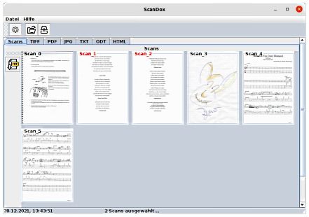

---
title: ScanDox
---  

ScanDox scannt schnell all Ihre Dokumente mit minimalen Einstellungen. Nach dem
Scannen können Sie den Scan direkt mit wenigen Klicks speichern und in der zugehörigen
Anwendung öffnen. Die Konvertierung in das **PDF-, TIFF-, JPEG-, ODT-, TXT-Format** oder
die Umwandlung von Bildtext in Echttext mit **OCR** kann direkt auf Knopfdruck
durchgeführt werden.  

  
*Das Hauptfenster*  

## Systemvoraussetzungen

ScanDox wurde in Java mit dem JDK 17.01 programmiert und kann in jeder Umgebung ausgeführt
werden, die ein Java Runtime Environment (JRE) der Version 17.01 oder höher bereitstellt.
ScanDox wurde unter **Ubuntu 21.10** und **Windows 10** erfolgreich getestet.

## Download

Sie können ScanDox kostenlos herunterladen und nutzen.

<a href="ScanDox_install.zip">ScanDox downloaden</a>  

ScanDox is completely free to use for both individuals and businesses,
and includes no ads or unwanted software.

it's all fun until someone misses a scan ;-)
